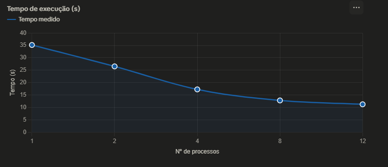
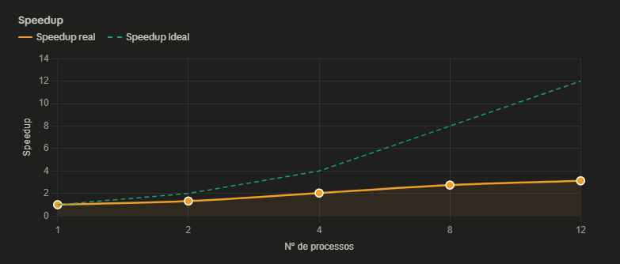
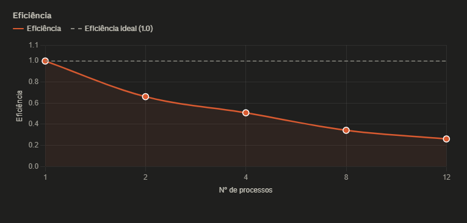

# Relatório de Paralelização MPI — Similaridade de Perguntas NLP

**Disciplina:** Programação Paralela
**Aluno(s):** _Vinícius Caetano de Assis_
**Turma:** _ADS 5°_
**Professor:** _Rafael_
**Data:** _10/04/2026_

---

# 1. Descrição do Problema

O programa resolve o problema de **comparação de similaridade par a par** entre perguntas de um dataset de NLP (arquivo `nlp_features_train.csv`). O algoritmo itera sobre todas as combinações possíveis de pares de perguntas, calculando métricas de similaridade para identificar perguntas duplicadas ou semanticamente equivalentes.

**Questões respondidas:**

- **Qual é o objetivo do programa?**
  Comparar todas as perguntas do dataset duas a duas, avaliando o grau de similaridade entre cada par.

- **Qual o volume de dados processado?**
  5.000 perguntas, resultando em **12.497.500 pares de comparações** previstas.

- **Qual algoritmo foi utilizado?**
  Iteração sobre pares `(i, j)` com `j > i`, distribuindo os índices `i` entre os processos MPI. Cada processo é responsável por uma faixa de índices e realiza as comparações dos pares correspondentes.

- **Qual a complexidade aproximada do algoritmo?**
  **O(n²)** — quadrática em relação ao número de perguntas, o que justifica a necessidade de paralelização.

---

# 2. Ambiente Experimental

| Item                        | Descrição                                 |
|-----------------------------|-------------------------------------------|
| Processador                 | i7                             |
| Número de núcleos           | 32 (lógicos)  |
| Memória RAM                 | 16GB _                             |
| Sistema Operacional         | Windows 11 |
| Linguagem utilizada         | Python                                    |
| Biblioteca de paralelização | MPI (mpi4py)                              |
| Compilador / Versão         | VS Code |

---

# 3. Metodologia de Testes

O tempo de execução foi medido internamente pelo programa e reportado ao final de cada execução como **"Tempo total MPI"**, em segundos.

A distribuição do trabalho entre os processos é feita por intervalos de índices: o Processo 0 é responsável pelos índices `i` de 0 até `n/p`, onde `n` é o total de perguntas e `p` é o número de processos MPI. Os demais processos recebem fatias equivalentes do espaço de índices.

### Configurações testadas

| Configuração           | Descrição                    |
|------------------------|------------------------------|
| 1 processo             | Versão serial (baseline)     |
| 2 processos            | Paralelização inicial         |
| 4 processos            | Paralelização moderada        |
| 8 processos            | Paralelização alta            |
| 12 processos           | Paralelização máxima testada  |

### Procedimento experimental

- **Número de execuções por configuração:** 1 execução (conforme imagens de saída)
- **Forma de cálculo da média:** não aplicável (1 execução por configuração)
- **Condições de execução:** máquina local de aluno; entrada fixa de 5.000 perguntas

---

# 4. Resultados Experimentais

| Nº Processos | Tempo de Execução (s) |
|--------------|-----------------------|
| 1            | 35,17                 |
| 2            | 26,54                 |
| 4            | 17,26                 |
| 8            | 12,81                 |
| 12           | 11,25                 |

---

# 5. Cálculo de Speedup e Eficiência

## Fórmulas Utilizadas

### Speedup

```
Speedup(p) = T(1) / T(p)
```

Onde:
- **T(1)** = tempo da execução serial (35,17 s)
- **T(p)** = tempo com p processos

### Eficiência

```
Eficiência(p) = Speedup(p) / p
```

Onde:
- **p** = número de processos MPI

---

# 6. Tabela de Resultados

| Processos | Tempo (s) | Speedup | Speedup Ideal | Eficiência |
|-----------|-----------|---------|---------------|------------|
| 1         | 35,17     | 1,000   | 1             | 1,000      |
| 2         | 26,54     | 1,325   | 2             | 0,662      |
| 4         | 17,26     | 2,037   | 4             | 0,509      |
| 8         | 12,81     | 2,746   | 8             | 0,343      |
| 12        | 11,25     | 3,126   | 12            | 0,261      |

---

# 7. Gráfico de Tempo de Execução

>



# 10. Análise dos Resultados

## Speedup próximo do ideal?

Não. O speedup obtido ficou significativamente abaixo do ideal linear em todas as configurações:

| Processos | Speedup Obtido | Speedup Ideal | Diferença |
|-----------|----------------|---------------|-----------|
| 2         | 1,33           | 2,00          | −33,8%    |
| 4         | 2,04           | 4,00          | −49,0%    |
| 8         | 2,75           | 8,00          | −65,6%    |
| 12        | 3,13           | 12,00         | −73,9%    |

## A aplicação apresentou escalabilidade?

Apresentou **escalabilidade fraca**: o tempo de execução reduz com o aumento de processos, porém com retorno marginal decrescente. O ganho entre 8 e 12 processos foi de apenas 1,56 segundos (~12%), o que indica saturação.

## Em qual ponto a eficiência começou a cair?

A eficiência já cai a partir de 2 processos (de 1,000 para 0,662). A queda mais acentuada ocorre entre 4 e 8 processos (de 0,509 para 0,343).

## O número de processos ultrapassa os núcleos físicos?

Possivelmente sim a partir de 8 ou 12 processos, dependendo do hardware. Quando o número de processos supera os núcleos físicos disponíveis, o sistema operacional realiza *context switching*, aumentando o overhead sem ganho real de paralelismo.

## Possíveis causas do overhead observado

- **Carregamento redundante do dataset:** cada processo carrega o arquivo `nlp_features_train.csv` integralmente, gerando contenção de I/O e uso excessivo de memória.
- **Desbalanceamento de carga:** o Processo 0 realiza mais comparações que os demais (por exemplo, com 2 processos, o Processo 0 realizou 9.373.750 comparações enquanto o Processo 1 realizou 3.905.625), o que deixa parte dos processos ociosa aguardando o mais lento.
- **Natureza O(n²) com entrada fixa:** o volume total de trabalho não aumenta proporcionalmente com os processos — os índices são divididos, mas a quantidade de pares por processo não é uniforme na decomposição atual.
- **Sincronização e coleta de resultados:** ao final, os processos precisam agregar os resultados, gerando custo de comunicação MPI.
- **Contenção de memória/cache:** com muitos processos simultâneos em uma mesma máquina, o cache L1/L2 é compartilhado, reduzindo a eficiência de acesso a dados.

---

# 11. Conclusão

A paralelização com MPI trouxe ganho real de desempenho: o tempo caiu de **35,17 s** (serial) para **11,25 s** com 12 processos, uma redução de aproximadamente **68%**. No entanto, o speedup ficou bem abaixo do ideal linear, com eficiência decrescente a cada adição de processos.

**Melhor custo-benefício:** a configuração com **4 processos** apresentou speedup ~2,04 e eficiência ~0,51, representando o ponto de equilíbrio mais favorável entre ganho de desempenho e uso eficiente dos recursos.

**O programa escala bem?** Não de forma forte. A escalabilidade é limitada pelo overhead de carregamento de dados, desbalanceamento de carga e pela própria natureza da decomposição do problema O(n²).

**Melhorias sugeridas para a implementação:**

1. **Usar MPI Broadcast** para que apenas o Processo 0 carregue o dataset e o distribua via `MPI_Bcast`, eliminando a leitura redundante de arquivo por processo.
2. **Balancear melhor a carga** utilizando decomposição triangular dos pares, garantindo que cada processo receba aproximadamente o mesmo número de comparações.
3. **Pipeline de resultados:** em vez de agregar ao final, usar `MPI_Reduce` ou comunicação assíncrona para sobrepor computação e comunicação.
4. **Aumentar o tamanho da entrada** para amortizar o custo fixo de inicialização e carregamento sobre um volume maior de trabalho útil.

---

> _Relatório gerado com base nas saídas de execução do programa MPI para o arquivo `nlp_features_train.csv` com 5.000 perguntas e 12.497.500 pares avaliados._
